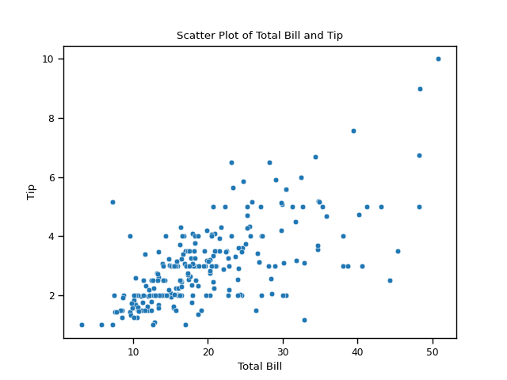
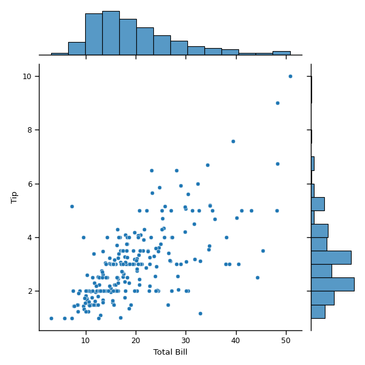

## 04-1. 데이터 시각화란?
1. '앤스컴 콰르텟'(Anscombe's quartet): 4개의 데이터셋으로 이루어진 데이터셋 예제로 평균, 분산, 상관관계, 회귀선이 모두 같아서
   같은 데이터셋으로 보일 수도 있지만 시각화하면 모두 경향이 다름
2. seaborn 라이브러리에 속해 있기 때문에 import seaborn as sns로 seaborn 라이브러리를 호출 후
   sns.load_dataset("anscombe")으로 불러올 수 있음

## 04-2. matplotlib 라이브러리란?
1. matplotlib는 널리 사용하는 파이썬 시각화 라이브러리이다. 하위 패키지인 pyplot을 블러오면 라이브러리의 다양한 시각화 기능을 사용할 수 있다.
   import matplotlib.pyplot as plt로 호출
2. plt.plot(x벡터, y벡터): 대부분의 기본 그래프를 그릴 수 있다.
3. plt.show(): 그래프를 호출할 수 있다.
4. plt.plot(x벡터, y벡터, 'o'): 인수로 'o'를 전달하면 점 그래프 형식으로 리턴함

### 그림 영역과 하위 그래프 이해하기
1. matplotlib은 하나의 그림 영역(Figure 객체)에 여러 개의 하위 그래프(Axes 객체)를 그리는 기능을 제공
```python 
     fig = plt.figure() # 그림 영역 Figure 객체 생성 
     axes1 = fig.add_subplot(2,2,1) # add_subplot(행,열,위치) 메서드로 하위 객체 Axes 생성 
     axes2 = fig.add_subplot(2,2,2)
     axes3 = fig.add_subplot(2,2,3)
     axes4 = fig.add_subplot(2,2,4)
```

2. axes.set_title(): 각 하위 그래프 axes의 이름을 지정할 수 있다.
3. fig.suptitle(): 그림객체 figure에 이를을 지정할 수 있다.
4. fig.set_tight_layout(True): 하위 그래프 사이에 제목을 삽입할 공간을 확보합니다.

📊 Anscombe's Quartet 시각화


## 04-3. matplotlib으로 그래프그리기
1. axes.set_xlabel: Axes 객체의 x축 이름을 설정
2. axes.set_ylabel: Axes 객체의 y축 이름을 설정
### 일변량 그래프 그리기
#### 히스토그램 그리기
axes.hist(data=데이터셋, x= '분석할 데이터열', bins= x축의 구간 개수) : 히스토그램 생성하는 메서드
```python
히스토그램 예제
fig = plt.figure() #figure 객체로 그림 영역 생성
axes1 = fig.add_subplot(1,1,1) #하위그래프 1개 생성

axes1.hist(data=tips, x='total_bill', bins=10) #tips 데이터의 total_bill열의 데이터를 히스토그램의 나타냄

axes1.set_title('Histogram of Total Bill')
axes1.set_xlabel('Total Bill')
axes1.set_ylabel('Frequency')

plt.show()
```
📊 Histogram by matplotlib 시각화


### 이변량 그래프 그리기
#### 산점도 그래프 그리기
axes.scatter(x축의 값, y축의 값): 산점도그래프 생성하는 메서드
```python
산점도 그래프 예제
scatter_plot = plt.figure() #figure 그림 객체 생성
axes1 = scatter_plot.add_subplot(1,1,1) #하위 그래프 생성

axes1.scatter(tips['total_bill'], tips['tip']) #산점도 그래프를 생성하는 scatter() 메서드, total bill과 tip의 상관 관계 비교

axes1.set_title('Scatterplot of Total Bill vs Tip')
axes1.set_xlabel('Total Bill')
axes1.set_ylabel('Tip')

plt.show()
```
📊 Scatterplot by matplotlib 시각화

#### 박스 그래프 그리기
axes.boxplot(x=[데이터1, 데이터2], labels=[데이터이름]): 박스형 그래프로 두가지 변수를 비교함
```python
박스 그래프 예제
boxplot = plt.figure()
axes1 = boxplot.add_subplot(1,1,1)

axes1.boxplot(
    x=[
        tips[tips['sex'] == 'Female']['tip'],
        tips[tips['sex'] == 'Male']['tip']
    ], labels = ['Female', 'Male']
)
#이산 변수: 성별
#연속변수: tip의 분산
axes1.set_xlabel('Sex')
axes1.set_ylabel('Tip')
axes1.set_title('Boxplot of Tips by Sex')

plt.show()
```
📊 Boxplot by matplotlib 시각화


### 다변량 그래프 그리기
1. 3개 이상의 변수를 나타내려면 산점도 그래프에서 점의 색깔 or 크기로 나타내는 방법이 있음
2. 사람은 크기 차이보다 색상 차이를 더 쉽게 구분함
3. 점의 크기 차이가 실제 값의 차이를 반영하는지도 확인해야함, 반지름이 r인 원의 넓이는 πr^2이므로 제곱을 반영함

#### 변수가 여러개인 그래프 그리기
-scatter()의 매개변수
1. 매개변수 s: 점의 크기를 지정할 수 있음
2. 매개변수 c: 점의 색상을 나타냄
3. alpha: 점의 투명도를 0~1 사이로 나타냄
4. *series.map(): 시리즈의 각 값에 함수를 적용하는 메서드. 파이썬의 map과는 다름
```python
변수가 여러개인 그래프 예제
colors = {"Female" : "#f1a340", "Male" : "#998ec3"} #성별로 색깔 지정

scatter_plot = plt.figure()
axes1 = scatter_plot.add_subplot(1,1,1)

axes1.scatter(data=tips,
             x = 'total_bill',
             y = 'tip',
             s=tips['size']**2*10, #점의 크기를 나타내는 매개변수를 s, size를 제곱한 사이즈에 10을 곱하여 원 크기로 나타냄
             c = tips['sex'].map(colors), # 색상을 나타내는 매개변수 c, 성별에 따른 색상
             alpha = 0.5) #alpha는 점의 투명도를 0~1 사이의 값으로 표현, 많이 겹치면 더 진해짐

axes1.set_title('Colored by Sex and Sized by Size')
axes1.set_xlabel('Total Bill')
axes1.set_ylabel('Tip')

scatter_plot.suptitle('Total Bill vs Tip')

plt.show()
```
📊 Total_billvsTip 시각화


## 04-4. seaborn으로 그래프 그리기
seaborn 라이브러리는 matplotlib에 기반을 둔 통계 그래프의 특화된 라이브러리이다.
### 다양한 그래프 그려 보기
#### 일변량 그래프 그리기
##### 1. 히스토그램 그리기
1. plt.subplot(): seaborn에서는 그림 객체와 하위 그래프 객체를 한 줄에 출력할 수 있음
2. sns.histplot(data=데이터셋, x='분석할 데이터열', ax=ax): 매개변수 ax에는 하위 그래프 객체를 지정한다.
```python
seaborn으로 히스토그램 그리기 예제
hist, ax = plt.subplots() #maplotlib과 다르게 그림 영역과 하위 그래프 객체를 한 번에 생성

sns.histplot(data= tips, x= 'total_bill', ax=ax) #ax에는 생성한 하위 그래프 객체를 지정
ax.set_title('Total Bill Histogram')

plt.show()
```
📊 Histogram by seaborn 시각화


##### 2. 밀도 분포 그래프 그리기
1. 밀도 분포 그래프: 각 값을 중심으로 정규 분포를 그리고 곡선 아래 넓이가 1이 되도록 겹친 그래프를 매끄럽게 만든것,
  커널 밀도 추정(kernel density estimation)이라고도 함
2. sns.kdeplot(data=데이터셋, x='분석할 데이터열', ax=ax): 밀도 분포 그래프를 그리는 메서드
```python
seaborn으로 밀도 분포 그래프 그리기 예제
den , ax = plt.subplots()

sns.kdeplot(data = tips, x = 'total_bill', ax= ax) #sns.kdeplot() 메서드로 밀도 분포 그래프를 그릴 수 있다.

ax.set_title('Total Bill Density')
ax.set_xlabel('Total Bill')
ax.set_ylabel('Unit Probablity')

plt.show()
```
📊 Kdeplot by seaborn 시각화


##### 3. 러그 그래프 그리기
1. 러그 그래프는 변수 분포를 1차원으로 나타냄
2. 러그 그래프는 일반적으로 다른 유형의 그래프에 추가정보를 제공할 때 사용(ex.히스토그램 + 러그)
```python
seaborn 이용하여 러그 그래프 그리기 예제
rug, ax = plt.subplots()

sns.rugplot(data=tips, x= 'total_bill', ax=ax)
sns.histplot(data=tips, x= 'total_bill', ax= ax)

ax.set_title('Rug plot and histogram of Total Bill')

plt.show()
```

📊 Rugplot by seaborn 시각화


##### 4. 분포 그래프 그리기
1. sns.displot(data=데이터셋, x='분석할 데이터열', kde= True, rug=True): 여러개의 일변량 그래프를 하나의 그래프로 표현할 수 있다
2. 기본 그래프는 히스토그램이지만 매개변수 kde, rug의 인수를 True로 지정하여 밀도분포그래프와 러그 그래프를 함께 표현할 수 있음
3. displot()은 그림객체인 FaceGrid 객체를 반환한다.
   • fig.set_axis_labels(x_var='x축의 데이터', y_var = 'y축의 데이터'): FaceGrid 객체이므로 이 메서드로 축의 이름을 지정할 수 있다
   • fig.figure.suptitle(): FacrGrid 객체를 이 메서드로 제목을 지정할 수 있다

```python
seaborn을 이용하여 분포 그래프 그리기 예제
fig.set_axis_labels(x_var = 'Total Bill', y_var = 'Count') #FaceGrid 객체이기 때문에 set_axis_labels메서드로 x축, y축 이름 지정
fig.figure.suptitle('Distribution of Total Bill') #figure.suptitle로 이름을 설정한다.

plt.show()
```

📊 Displot by seaborn 시각화


##### 5. 막대그래프 그리기
1. 히스토그램과 비슷하지만 막대로 이산변수의 개수를 표현함
2. sns.countplot(data=데이터셋, x='분석할 데이터열', palette = 'viridis', ax=ax): 막대그래프를 그릴 수 있는 함수임
3. palette 매개변수에 색상 팔레트를 지정하여 각 그래프의 색상을 정할 수 있다. 여기서는 'viridis'라는 팔레트 사용

```python
seaborn을 이용하여 막대그래프 그리기 예제
count, ax = plt.subplots()
sns.countplot(data = tips, x = 'day', palette = 'viridis', ax= ax) #counplot() 메서드로 막대그래프를 그릴 수 있으며, palette로 그래프의 색상을 지정함

ax.set_title('Count of days')
ax.set_xlabel('Day of the Week')
ax.set_ylabel('Frequency')

plt.show()
```

📊 Countplot by seaborn 시각화


#### 이변량 그래프 그리기

##### 1. 산점도 그래프 그리기 ①-sns.scatterplot()
1. sns.scatterplot(data=데이터셋, x='분석할 데이터열', y='분석할 데이터열', ax=ax): Axes 객체로 산점도 그래프를 반환함
2. 
```python
scatterplot()으로 산점도 그래프 그리기 예제
scatter, ax = plt.subplots()

sns.scatterplot(data = tips, x='total_bill', y = 'tip', ax=ax) #plt.scatterplots(): Axes객체를 반환하는 산점도 그래프를 그리는 메서드

ax.set_title('Scatter Plot of Total Bill and Tip')
ax.set_xlabel('Total Bill')
ax.set_ylabel('Tip')

plt.show()
```

📊 Scatterplot by sns.scatterplot() 시각화


##### 2. 산점도 그래프 그리기 ②-sns.regplot()
1. sns.regplot(data=데이터셋, x='분석할 데이터열', y='분석할 데이터열', ax=ax): Axes 객체로 산점도 그래프 그리는 함수, 회귀선도 함께 그림, 매개변수 fit_reg를 False로 설정하면 회귀선은 그리지 않음
2. 회귀선: 두 변수간의 상관관계를 선형으로 나타낸 것

``` python
regplot()으로 산점도 그래프 그리기 예제
reg, ax = plt.subplots()

sns.regplot(data=tips, x='total_bill', y='tip', ax=ax) #sns.regplot(): Axes 객체를 생성하는 산점도그래프 메서드, 회귀선도 같이 그린다

ax.set_title('Regression Plot of Total Bill and Tip')
ax.set_xlabel('Total Bill')
ax.set_ylabel('Tip')

plt.show()
```

📊 Scatterplot by sns.regplot() 시각화


##### 3. 산점도 그래프 그리기 ③-sns.lmplot()
1. sns.lmplot(data=tips, x='total_bill', y='tip'): Facegrid 객체를 직접 생성하여 산점도 그래프를 회귀선과 같이 반환하는 함수
2. fig.figure.

```python
lmplot()으로 산점도 그래프 그리기 예제
fig = sns.lmplot(data = tips, x='total_bill', y = 'tip')

fig.set_axis_labels('Total Bill', 'Tip') #set_axis_labels()안에는 두 가지 인수만 넣으면 됨
fig.figure.suptitle('Regression plot of Total Bill and Tip', y= 1.03)


plt.show()
```
📊 Scatterplot by sns.lmplot() 시각화


##### 4. 조인트 그래프 그리기 
1. sns.jointplot(data=데이터셋, x= '분석할 데이터열', y= '분석할 데이터열'): JointGrid 객체로 산점도 그래프와 x축과 y축에 일변량 그래프를 함께 그리는 함수
```python
seaborn으로 조인트그래프 그리기 예제
joint = sns.jointplot(data=tips, x='total_bill', y ='tip') #sns.jointplot()는 하위 그래프를 반환하지 않으므로 하위영역을 그릴 그림 영역의 생성이 필요 없음. JointGrid 객체를 반환함
joint.set_axis_labels('Total Bill', 'Tip') 

joint.figure.suptitle('Joint Plot of Total Bill and Tip', y= 1.03) #set_title() 메서드는 각 Axes 객체에 제목을 정할 때 사용하고, suptitle() 메서드는 figure객체의 제목을 정할 때 사용한다. y매개변수는 제목의 위치를 설정하는데에 사용하는데 1.03은 좀 높은편(자주쓰임)

plt.show()
```
📊 Joinplot by seaborn 시각화


##### 5. 육각 그래프 그리기
1. 2개의 변수를 비교할 때는 산점도 그래프가 유용하지만 표시할 데이터가 너무 많다면 인접한 점을 구간별로 묶어서 표시하는 육각 그래프가 깔끔하다.
2. sns.joinplot(data= 데이터셋, x='분석할 데이터열', y='분석할 데이터열', kind="hex"): joinplot()함수에 매개변수 kind="hex"만 지정하면 된다
```python
seaborn으로 육각그래프 그리기 예제
hexbin = sns.jointplot(data = tips, x= "total_bill", y= "tip", kind ="hex") #2개의 변수를 비교할 때 산점도의 인접한 점들을 구간별로 묶어서 표시하는 육각 그래프, jointplot() 메서드에 매개변수 kind ="hex"만 지정하면 된다.

hexbin.set_axis_labels('Total Bill', 'tip')
hexbin.figure.suptitle('Hexbin Joint Plot of Total Bill and Tip', y =1.03)

plt.show()
```
📊 hexbin by seaborn 시각화


##### 6. 2차원 밀도 분포 그래프 그리기-① kdeplot()
1. sns.kdeplot(data= 데이터셋, x="분석할 데이터열", y="분석할 데이터열", fill=True, ax=ax): kdeplot()에 두가지 변수를 전달하고 fill=True를 매개변수로 전달하면 음영효과를 줄 수 있다.

```python
kdeplot()으로 2차원 밀도 분포 그리기 예제
kde, ax = plt.subplots()

sns.kdeplot(data = tips, x= "total_bill", y="tip", fill=True, ax=ax) #sns.kdeplot() 메서드를 통해서 2차원 밀도 분포 그래프를 그릴 수 있다. 일변량 밀도 분포 그래프도 이 메서드 사용함. 매개변수 fill에 True를 전달하면 그래프에 음영효과를 줄 수 있다

ax.set_title('Kernel Density Plot of Total Bill and Tip')
ax.set_xlabel('Total Bill')
ax.set_ylabel('Tip')

plt.show()
```
📊 kdeplot_2dem by kdeplot 시각화


##### 7. 2차원 밀도 분포 그래프 그리기-② joinplot()
1. sns.joinplot(data= 데이터셋, x='분석할 데이터열', y='분석할 데이터열', kind="kde"): jointplot()의 매개변수로 kind="kde"를 전달하면 2차원 밀도 분포 그래프로 그릴 수 있다.
```python
jointplot()으로 2차원 밀도 분포 그리기 예제
kde2d = sns.jointplot(data=tips, x= "total_bill", y = "tip", kind='kde') #sns.jointplot()으로도 밀도 분포 그래프를 그릴 수 있습니다. 매개변수 kind에 'kde'를 전달

kde2d.set_axis_labels(xlabel = 'Total bill', ylabel = 'Tip')
kde2d.figure.suptitle('Hexbin Joint plot of Total Bill and Tip', y=1.03)

plt.show()
```
📊 kdeplot_2dem by jointplot 시각화


