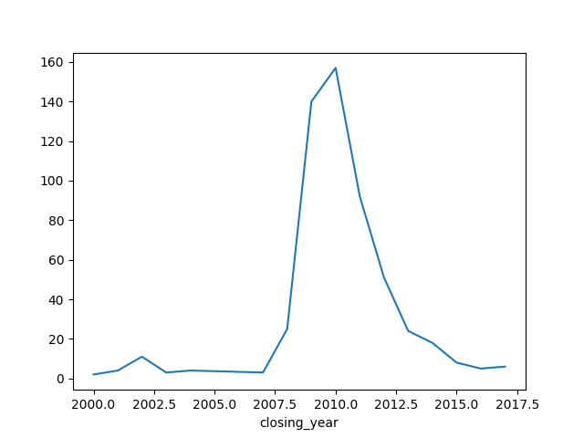

# 12-1. datetime 객체 활용하기
1. datetime 라이브러리 불러오기
```python
from datetime import datetime
```
2. datetime 객체의 now() 메서드를 사용하여 현재 날짜와 시간 정보를 확인할 수 있다.
```python
now = datetime.now()
print(now)
```
📝 실행결과
```
2025-07-26 01:47:26.798880
```

3. 원하는 날짜와 시간으로 datetime 객체를 생성할 수도 있다.
```python
t1 = datetime.now()
t2 = datetime(1970,1,1)
print(t1)
print(t2)
```
📝 실행결과
```
2025-07-25 23:48:49.464421
1970-01-01 00:00:00
```

4. datetime 객체는 수학 연산자로 시간 차이를 계산할 수 있는 기능을 제공
```python
diff = t1-t2
print(diff)
```
📝 실행결과
```
20294 days, 23:48:49.464421
```
5. datetime 객체를 사용하여 계산한 시간의 차이는 timedelta 객체로 표현된다
```python
print(type(diff))
```
📝 실행결과
```
<class 'datetime.timedelta'>
```

# 12-2. datetime으로 변환하기
1. 에볼라 데이터셋 불러오기
```
ebola.iloc[:5,:5]
         Date  Day  Cases_Guinea  Cases_Liberia  Cases_SierraLeone
0    1/5/2015  289        2776.0            NaN            10030.0
1    1/4/2015  288        2775.0            NaN             9780.0
2    1/3/2015  287        2769.0         8166.0             9722.0
3    1/2/2015  286           NaN         8157.0                NaN
4  12/31/2014  284        2730.0         8115.0             9633.0
```

2. info() 메서드로 이 날짜 정보가 어떤 자료형인지 확인
```python
print(ebola.info())
```
📝 실행결과
```
<class 'pandas.core.frame.DataFrame'>
RangeIndex: 122 entries, 0 to 121
Data columns (total 18 columns):
 #   Column               Non-Null Count  Dtype  
---  ------               --------------  -----  
 0   Date                 122 non-null    object  # 날짜 정보는 object형이다.
 1   Day                  122 non-null    int64  
 2   Cases_Guinea         93 non-null     float64
 3   Cases_Liberia        83 non-null     float64
 4   Cases_SierraLeone    87 non-null     float64
 5   Cases_Nigeria        38 non-null     float64
 6   Cases_Senegal        25 non-null     float64
 7   Cases_UnitedStates   18 non-null     float64
 8   Cases_Spain          16 non-null     float64
 9   Cases_Mali           12 non-null     float64
 10  Deaths_Guinea        92 non-null     float64
 11  Deaths_Liberia       81 non-null     float64
 12  Deaths_SierraLeone   87 non-null     float64
 13  Deaths_Nigeria       38 non-null     float64
 14  Deaths_Senegal       22 non-null     float64
 15  Deaths_UnitedStates  18 non-null     float64
 16  Deaths_Spain         16 non-null     float64
 17  Deaths_Mali          12 non-null     float64
dtypes: float64(16), int64(1), object(1)
memory usage: 17.3+ KB
None
```

3. to_datetime() 함수를 사용하려 Date 열의 값을 datetime형으로 변환하여 새로운 열 date_dt로 저장
```python
ebola['date_dt'] = pd.to_datetime(ebola['Date'])
```

4. 매개변수 format으로 데이터를 datetime 객체로 변환하는 방법을 좀 더 명확하게 지정할 수 있다.
```python
ebola['date_dt'] = pd.to_datetime(ebola['Date'], format = '%m/%d/%Y')
```

5. info()를 사용하여 새로 생성한 date_dt 열의 자료형을 확인
```python
print(ebola.info())
```
📝 실행결과
```
<class 'pandas.core.frame.DataFrame'>
RangeIndex: 122 entries, 0 to 121
Data columns (total 19 columns):
 #   Column               Non-Null Count  Dtype         
---  ------               --------------  -----         
 0   Date                 122 non-null    object        
 1   Day                  122 non-null    int64         
 2   Cases_Guinea         93 non-null     float64       
 3   Cases_Liberia        83 non-null     float64       
 4   Cases_SierraLeone    87 non-null     float64       
 5   Cases_Nigeria        38 non-null     float64       
 6   Cases_Senegal        25 non-null     float64       
 7   Cases_UnitedStates   18 non-null     float64       
 8   Cases_Spain          16 non-null     float64       
 9   Cases_Mali           12 non-null     float64       
 10  Deaths_Guinea        92 non-null     float64       
 11  Deaths_Liberia       81 non-null     float64       
 12  Deaths_SierraLeone   87 non-null     float64       
 13  Deaths_Nigeria       38 non-null     float64       
 14  Deaths_Senegal       22 non-null     float64       
 15  Deaths_UnitedStates  18 non-null     float64       
 16  Deaths_Spain         16 non-null     float64       
 17  Deaths_Mali          12 non-null     float64       
 18  date_dt              122 non-null    datetime64[ns]  #datetime 형으로 바뀐 것을 확인
dtypes: datetime64[ns](1), float64(16), int64(1), object(1)
memory usage: 18.2+ KB
None
```
* 31-0-2014와 같이 일이 먼저 나오는 형식으로 하고 싶다면 매개변수 dayfirst를 True로 설정
* 2014-03-31과 같이 연도가 먼저 나오는 형식으로 하고 싶다면 매개변수 yearfirst를 True로 설정

# 12-3. 시계열 데이터 불러오기
* read_csv() 함수는 parse_dates, inher_datetime_format, keep_date_col, date_parser_dayfirst, cache_dates처럼 시계열 데이터를 처리하는 다양한 매개변수 제공
1. 데이터의 Date 열을 매개변수 Parse_dates에 전달하여 바로 datetime형으로 변환
```python
ebola = pd.read_csv('country_timeseries.csv', parse_dates = ['Date'])
print(ebola.info())
```
📝 실행결과
```
<class 'pandas.core.frame.DataFrame'>
RangeIndex: 122 entries, 0 to 121
Data columns (total 18 columns):
 #   Column               Non-Null Count  Dtype         
---  ------               --------------  -----         
 0   Date                 122 non-null    datetime64[ns] #datetime으로 바로 변환된 것을 확인
 1   Day                  122 non-null    int64         
 2   Cases_Guinea         93 non-null     float64       
 3   Cases_Liberia        83 non-null     float64       
 4   Cases_SierraLeone    87 non-null     float64       
 5   Cases_Nigeria        38 non-null     float64       
 6   Cases_Senegal        25 non-null     float64       
 7   Cases_UnitedStates   18 non-null     float64       
 8   Cases_Spain          16 non-null     float64       
 9   Cases_Mali           12 non-null     float64       
 10  Deaths_Guinea        92 non-null     float64       
 11  Deaths_Liberia       81 non-null     float64       
 12  Deaths_SierraLeone   87 non-null     float64       
 13  Deaths_Nigeria       38 non-null     float64       
 14  Deaths_Senegal       22 non-null     float64       
 15  Deaths_UnitedStates  18 non-null     float64       
 16  Deaths_Spain         16 non-null     float64       
 17  Deaths_Mali          12 non-null     float64       
dtypes: datetime64[ns](1), float64(16), int64(1)
memory usage: 17.3 KB
None
```

# 12-4. 시간 정보 추출하기
* datetime 객체에서 연,월,일과 같은 시간 정보 요소를 따로 추출할 수 있다.
* to_datetime()에 일시를 나타내는 문자열을 전달하면 Timestamp 객체를 반환한다.
1. '2021-12-14'를 to_datetime()에 전달하여 Timestamp 객체를 생성하고 연, 월, 일을 추출
```python
d = pd.to_datetime('2021-12-14')
print(d)
print(type(d))
```
📝 실행결과
```
2021-12-14 00:00:00
<class 'pandas._libs.tslibs.timestamps.Timestamp'> #timestamp 객체인 것을 확인
```

2. 연, 월, 일을 각각 year, month, day 속성으로 추출
```python
print(d.year)
print(d.month)
print(d.day)
```
📝 실행결과
```
2021
12
14
```

3. 에볼라 데이터셋의 Date 열을 datetime으로 변환하여 date_dt 열에 저장
```python
ebola['date_dt'] = pd.to_datetime(ebola['Date'])
print(ebola[['Date', 'date_dt']])
```
📝 실행결과
```
          Date    date_dt
0   2015-01-05 2015-01-05
1   2015-01-04 2015-01-04
2   2015-01-03 2015-01-03
3   2015-01-02 2015-01-02
4   2014-12-31 2014-12-31
..         ...        ...
117 2014-03-27 2014-03-27
118 2014-03-26 2014-03-26
119 2014-03-25 2014-03-25
120 2014-03-24 2014-03-24
121 2014-03-22 2014-03-22

[122 rows x 2 columns]

```

4. dt 속성을 사용하면 전체 열을 대상으로 datetime 객체의 메서드를 적용할 수 있다. year로 연도 추출하여 새로운 열에 저장
```python
ebola['year'] = ebola['date_dt'].dt.year
print(ebola[['Date', 'date_dt', 'year']])
```
📝 실행결과
```
          Date    date_dt  year
0   2015-01-05 2015-01-05  2015
1   2015-01-04 2015-01-04  2015
2   2015-01-03 2015-01-03  2015
3   2015-01-02 2015-01-02  2015
4   2014-12-31 2014-12-31  2014
..         ...        ...   ...
117 2014-03-27 2014-03-27  2014
118 2014-03-26 2014-03-26  2014
119 2014-03-25 2014-03-25  2014
120 2014-03-24 2014-03-24  2014
121 2014-03-22 2014-03-22  2014

[122 rows x 3 columns]
```

5. 마찬가지의 방법으로 월과 일도 추출하여 month, day 열에 저장
```python
ebola = ebola.assign(
    month = ebola["date_dt"].dt.month,
    day = ebola["date_dt"].dt.day
)
print(ebola[['Date', 'date_dt', 'year', 'month', 'day']])
```
6. info() 메서드로 새로 생성한 세 열의 자료형을 살펴본다.
```python
print(ebola.info())
```
📝 실행결과
```
<class 'pandas.core.frame.DataFrame'>
RangeIndex: 122 entries, 0 to 121
Data columns (total 22 columns):
 #   Column               Non-Null Count  Dtype         
---  ------               --------------  -----         
 0   Date                 122 non-null    datetime64[ns]
 1   Day                  122 non-null    int64         
 2   Cases_Guinea         93 non-null     float64       
 3   Cases_Liberia        83 non-null     float64       
 4   Cases_SierraLeone    87 non-null     float64       
 5   Cases_Nigeria        38 non-null     float64       
 6   Cases_Senegal        25 non-null     float64       
 7   Cases_UnitedStates   18 non-null     float64       
 8   Cases_Spain          16 non-null     float64       
 9   Cases_Mali           12 non-null     float64       
 10  Deaths_Guinea        92 non-null     float64       
 11  Deaths_Liberia       81 non-null     float64       
 12  Deaths_SierraLeone   87 non-null     float64       
 13  Deaths_Nigeria       38 non-null     float64       
 14  Deaths_Senegal       22 non-null     float64       
 15  Deaths_UnitedStates  18 non-null     float64       
 16  Deaths_Spain         16 non-null     float64       
 17  Deaths_Mali          12 non-null     float64       
 18  date_dt              122 non-null    datetime64[ns]
 19  year                 122 non-null    int32          # 추출한 요소는 datetime형이 아니라 int32형이다.
 20  month                122 non-null    int32         
 21  day                  122 non-null    int32         
dtypes: datetime64[ns](2), float64(16), int32(3), int64(1)
memory usage: 19.7 KB
None
```

# 12-5. 시간 간격 계산하기
1. 데이터셋의 왼쪽 아래에 있는 5개의 행, 열 데이터 살펴보기
```python
print(ebola.iloc[-5:,:5])
```
📝 실행결과
```
          Date  Day  Cases_Guinea  Cases_Liberia  Cases_SierraLeone
117 2014-03-27    5         103.0            8.0                6.0
118 2014-03-26    4          86.0            NaN                NaN
119 2014-03-25    3          86.0            NaN                NaN
120 2014-03-24    2          86.0            NaN                NaN
121 2014-03-22    0          49.0            NaN                NaN
```

2. date_dt 열에서 min() 메서드를 호출하여 가장 오래된 날짜를 구한다.
```python
print(ebola['date_dt'].min())
```
📝 실행결과
```
2014-03-22 00:00:00
```

3. date_dt 열에서 이 값을 빼면 며칠이 지난 데이터인지 계산하여 새로운 열에 계산한 값을 넣는다.
```python
ebola['outbreak_d'] = ebola['date_dt'] - ebola['date_dt'].min()
print(ebola[['Date', 'Day', 'outbreak_d']])
```
📝 실행결과
```
          Date  Day outbreak_d  # Day열과  outbreak_d 열이 같다.
0   2015-01-05  289   289 days   
1   2015-01-04  288   288 days
2   2015-01-03  287   287 days
3   2015-01-02  286   286 days
4   2014-12-31  284   284 days
..         ...  ...        ...
117 2014-03-27    5     5 days
118 2014-03-26    4     4 days
119 2014-03-25    3     3 days
120 2014-03-24    2     2 days
121 2014-03-22    0     0 days

[122 rows x 3 columns]
```

4. info()로 oubreak_d 열의 자료형을 확인한 결과 timedelta형이다.
```python
print(ebola.info())
```
📝 실행결과
```
<class 'pandas.core.frame.DataFrame'>
RangeIndex: 122 entries, 0 to 121
Data columns (total 23 columns):
 #   Column               Non-Null Count  Dtype          
---  ------               --------------  -----          
 0   Date                 122 non-null    datetime64[ns] 
 1   Day                  122 non-null    int64          
 2   Cases_Guinea         93 non-null     float64        
 3   Cases_Liberia        83 non-null     float64        
 4   Cases_SierraLeone    87 non-null     float64        
 5   Cases_Nigeria        38 non-null     float64        
 6   Cases_Senegal        25 non-null     float64        
 7   Cases_UnitedStates   18 non-null     float64        
 8   Cases_Spain          16 non-null     float64        
 9   Cases_Mali           12 non-null     float64        
 10  Deaths_Guinea        92 non-null     float64        
 11  Deaths_Liberia       81 non-null     float64        
 12  Deaths_SierraLeone   87 non-null     float64        
 13  Deaths_Nigeria       38 non-null     float64        
 14  Deaths_Senegal       22 non-null     float64        
 15  Deaths_UnitedStates  18 non-null     float64        
 16  Deaths_Spain         16 non-null     float64        
 17  Deaths_Mali          12 non-null     float64        
 18  date_dt              122 non-null    datetime64[ns] 
 19  year                 122 non-null    int32          
 20  month                122 non-null    int32          
 21  day                  122 non-null    int32          
 22  outbreak_d           122 non-null    timedelta64[ns]
dtypes: datetime64[ns](2), float64(16), int32(3), int64(1), timedelta64[ns](1)
memory usage: 20.6 KB
None
```

# 12-6. datetime 객체의 메서드 활용하기.
1. 파산한 은행 정보의 banklist 데이터셋을 사용
```python
banks = pd.read_csv('banklist.csv')
print(banks.head())
```
📝 실행결과
```
                                           Bank Name                City  ST  \
0                                Fayette County Bank          Saint Elmo  IL   
1  Guaranty Bank, (d/b/a BestBank in Georgia & Mi...           Milwaukee  WI   
2                                     First NBC Bank         New Orleans  LA   
3                                      Proficio Bank  Cottonwood Heights  UT   
4                      Seaway Bank and Trust Company             Chicago  IL   

    CERT                Acquiring Institution Closing Date Updated Date  
0   1802            United Fidelity Bank, fsb    26-May-17    26-Jul-17  
1  30003  First-Citizens Bank & Trust Company     5-May-17    26-Jul-17  
2  58302                         Whitney Bank    28-Apr-17    26-Jul-17  
3  35495                    Cache Valley Bank     3-Mar-17    18-May-17  
4  19328                  State Bank of Texas    27-Jan-17    18-May-17
```

2. read_csv()의 매개변수 parse_dates에 날짜 정보가 담긴 Closing Date, Updated Date 열을 전달하여 두 열을 datetime형으로 불러올 수 있다.
```python
banks = pd.read_csv(
         'banklist.csv', pasrse_dates=["Closing Date", "Updated Date"]
)
print(banks.info())
```
📝 실행결과
```
<class 'pandas.core.frame.DataFrame'>
RangeIndex: 553 entries, 0 to 552
Data columns (total 7 columns):
 #   Column                 Non-Null Count  Dtype         
---  ------                 --------------  -----         
 0   Bank Name              553 non-null    object        
 1   City                   553 non-null    object        
 2   ST                     553 non-null    object        
 3   CERT                   553 non-null    int64         
 4   Acquiring Institution  553 non-null    object        
 5   Closing Date           553 non-null    datetime64[ns] #datetime 형이 된다
 6   Updated Date           553 non-null    datetime64[ns]
dtypes: datetime64[ns](2), int64(1), object(4)
memory usage: 30.4+ KB
None
```
3. 은행이 파산한 분기와 연도를 기반으로 데이터 분석
```python
banks = banks.assign(
         closing_quarter=banks['Closing Date'].dt.quarter,
         closing_year= banks['Closing Date'].dt.year
)
```

4. 파산한 연도를 나타내는 closing_year 열을 기준으로 그룹화하고 연도별 파산한 은행 개수를 size()로 계산한 시리즈를 closing_year 변수에 저장
```python
closing_year = banks.groupby(['clsoing_year']).size()
print(closing_year)
```
📝 실행결과
```
closing_year
2000      2
2001      4
2002     11
2003      3
2004      4
2007      3
2008     25
2009    140
2010    157
2011     92
2012     51
2013     24
2014     18
2015      8
2016      5
2017      6
dtype: int64
```

5. 매년 각 분기에 파산한 은행이 궁금하다면 closing_year와 closing_quarter를 기준으로 데이터셋을 그룹화하고 size()로 해당하는 은행 개수를 구할 수 있다.
```python
closing_year_q = (
         banks
         .groupby(['closing_year', 'closing_quarter'])
         .size()
)

print(closing_year_q)
```
📝 실행결과
```
closing_year  closing_quarter
2000          4                   2
2001          1                   1
              2                   1
              3                   2
2002          1                   6
              2                   2
              3                   1
              4                   2
2003          1                   1
              2                   1
              4                   1
2004          1                   3
              2                   1
2007          1                   1
              3                   1
              4                   1
2008          1                   2
              2                   2
              3                   9
              4                  12
2009          1                  21
              2                  24
              3                  50
              4                  45
2010          1                  41
              2                  45
              3                  41
              4                  30
2011          1                  26
              2                  22
              3                  26
              4                  18
2012          1                  16
              2                  15
              3                  12
              4                   8
2013          1                   4
              2                  12
              3                   6
              4                   2
2014          1                   5
              2                   7
              3                   2
              4                   4
2015          1                   4
              2                   1
              3                   1
              4                   2
2016          1                   1
              2                   2
              3                   2
2017          1                   3
              2                   3
dtype: int64
```

6. 연도별 분기별 파산한 은행 개수를 시각화
```python
import matplotlib.pyplot as plt

fig,ax = plt.subplots()
ax = closing_year.plot()
plt.show()
```
📊 closing_year 시각화


```python
fig, ax = plt.subplots()
ax = closing_year_q.plot()
plt.show()
```
📊 closing_year_q 시각화


# 12-7. 주식 데이터 다루기
1. pandas-datareader 라이브러리 설치
```python
!pip install pandas-datareader
```

2. 테슬라 주식 데이터 불러오기
```python
import pandad_datareader.data as web

tesla = web.DataReader('TSLA', 'stooq')
print(tesla)
```
📝 실행결과
```
                Open      High       Low     Close     Volume
Date                                                         
2025-07-25  308.7400  323.6300  308.0100  316.0600  148227027
2025-07-24  310.0000  310.1500  300.4100  305.3000  156966023
2025-07-23  330.9000  336.2000  328.6700  332.5600   92553756
2025-07-22  329.7400  335.4098  321.5500  332.1100   77370371
2025-07-21  334.4000  338.0000  326.8800  328.4900   75768797
...              ...       ...       ...       ...        ...
2020-07-31  101.0000  101.1370   94.7333   95.3833  183704400
2020-07-30   99.2000  100.8830   98.0667   99.1667  114315585
2020-07-29  100.0670  102.3200   99.1333   99.9400  141403395
2020-07-28  100.2670  104.3130   98.2933   98.4333  237130500
2020-07-27   95.6667  103.1970   94.2000  102.6400  240730035

[1256 rows x 5 columns]
```

3. tesla 인덱스 살펴보기
```python
tesla.info() 
```
📝 실행결과
```
<class 'pandas.core.frame.DataFrame'>
DatetimeIndex: 1256 entries, 2025-07-25 to 2020-07-27 #DatatimeIndex이다. datetime 객체를 데이터프레임의 인덱스로 설정할 때 사용하는 객체
Data columns (total 5 columns):
 #   Column  Non-Null Count  Dtype  
---  ------  --------------  -----  
 0   Open    1256 non-null   float64
 1   High    1256 non-null   float64
 2   Low     1256 non-null   float64
 3   Close   1256 non-null   float64
 4   Volume  1256 non-null   int64  
dtypes: float64(4), int64(1)
memory usage: 58.9 KB
```

4. tesla_stock_yahoo 파일 불러오기
```python
tesla = pd.read_csv('tesla_stock_yahoo.csv')
print(tesla.head())
```
📝 실행결과
```
         Date       Open   High        Low      Close  Adj Close    Volume
0  2010-06-29  19.000000  25.00  17.540001  23.889999  23.889999  18766300
1  2010-06-30  25.790001  30.42  23.299999  23.830000  23.830000  17187100
2  2010-07-01  25.000000  25.92  20.270000  21.959999  21.959999   8218800
3  2010-07-02  23.000000  23.10  18.709999  19.200001  19.200001   5139800
4  2010-07-06  20.000000  20.00  15.830000  16.110001  16.110001   6866900
```

5. 날짜 형식의 Date열을 datetime형으로 다시 불러오기
```python
tesla = pd.read_csv(
         'tesla_stock_yahoo.csv' , parse_dates=["Date"]
```

6. info() 메서드로 정보확인
```python
print(tesla.info())
```
📝 실행결과
```
<class 'pandas.core.frame.DataFrame'>
RangeIndex: 1791 entries, 0 to 1790
Data columns (total 7 columns):
 #   Column     Non-Null Count  Dtype         
---  ------     --------------  -----         
 0   Date       1791 non-null   datetime64[ns]  Date 열이 datetime형으로 바뀜
 1   Open       1791 non-null   float64       
 2   High       1791 non-null   float64       
 3   Low        1791 non-null   float64       
 4   Close      1791 non-null   float64       
 5   Adj Close  1791 non-null   float64       
 6   Volume     1791 non-null   int64         
dtypes: datetime64[ns](1), float64(5), int64(1)
memory usage: 98.1 KB
None
```

# 12-8. 시간별 데이터 추출하기
1. 주식 데이터셋에서 2010년 6월 데이터만 추출하기
```python
print(
    tesla.loc[
         (tesla.Date.dt.year == 2010) % (tesla.Date.dt.month == 6)
    ]
)
```
📝 실행결과
```
         Date  Open  High        Low      Close  Adj Close    Volume
0  2010-06-29  19.0  25.0  17.540001  23.889999  23.889999  18766300
0  2010-06-29  19.0  25.0  17.540001  23.889999  23.889999  18766300
0  2010-06-29  19.0  25.0  17.540001  23.889999  23.889999  18766300
0  2010-06-29  19.0  25.0  17.540001  23.889999  23.889999  18766300
0  2010-06-29  19.0  25.0  17.540001  23.889999  23.889999  18766300
..        ...   ...   ...        ...        ...        ...       ...
0  2010-06-29  19.0  25.0  17.540001  23.889999  23.889999  18766300
0  2010-06-29  19.0  25.0  17.540001  23.889999  23.889999  18766300
0  2010-06-29  19.0  25.0  17.540001  23.889999  23.889999  18766300
0  2010-06-29  19.0  25.0  17.540001  23.889999  23.889999  18766300
0  2010-06-29  19.0  25.0  17.540001  23.889999  23.889999  18766300

[1791 rows x 7 columns]
```

### DatetimeIndex 객체로 추출하기
1. tesla 데이터셋의 Date열을 인덱스로 설정
```python
tesla.index = tesla['Date']
print(tesla.index)
```
📝 실행결과
```
DatetimeIndex(['2010-06-29', '2010-06-30', '2010-07-01', '2010-07-02',
               '2010-07-06', '2010-07-07', '2010-07-08', '2010-07-09',
               '2010-07-12', '2010-07-13',
               ...
               '2017-07-26', '2017-07-27', '2017-07-28', '2017-07-31',
               '2017-08-01', '2017-08-02', '2017-08-03', '2017-08-04',
               '2017-08-07', '2017-08-08'],
              dtype='datetime64[ns]', name='Date', length=1791, freq=None)
```

2. datetime 객체를 인덱스로 설정하면 원하는 날짜의 데이터를 쉽게 추출할 수 있다.
```
print(tesla.loc['2015'])
```
📝 실행결과
```
                 Date        Open        High         Low       Close  \
Date                                                                    
2015-01-02 2015-01-02  222.869995  223.250000  213.259995  219.309998   
2015-01-05 2015-01-05  214.550003  216.500000  207.160004  210.089996   
2015-01-06 2015-01-06  210.059998  214.199997  204.210007  211.279999   
2015-01-07 2015-01-07  213.350006  214.779999  209.779999  210.949997   
2015-01-08 2015-01-08  212.809998  213.800003  210.009995  210.619995   
...               ...         ...         ...         ...         ...   
2015-12-24 2015-12-24  230.559998  231.880005  228.279999  230.570007   
2015-12-28 2015-12-28  231.490005  231.979996  225.539993  228.949997   
2015-12-29 2015-12-29  230.059998  237.720001  229.550003  237.190002   
2015-12-30 2015-12-30  236.600006  243.630005  235.669998  238.089996   
2015-12-31 2015-12-31  238.509995  243.449997  238.369995  240.009995   

             Adj Close   Volume  
Date                             
2015-01-02  219.309998  4764400  
2015-01-05  210.089996  5368500  
2015-01-06  211.279999  6261900  
2015-01-07  210.949997  2968400  
2015-01-08  210.619995  3442500  
...                ...      ...  
2015-12-24  230.570007   708000  
2015-12-28  228.949997  1901300  
2015-12-29  237.190002  2406300  
2015-12-30  238.089996  3697900  
2015-12-31  240.009995  2683200  

[252 rows x 7 columns]
```

3. 특정 연과 월을 기준으로 데이터를 추출할 수도 있다
```python
print(tesla.loc['2010-06'])
```
📝 실행결과
```
                 Date       Open   High        Low      Close  Adj Close  \
Date                                                                       
2010-06-29 2010-06-29  19.000000  25.00  17.540001  23.889999  23.889999   
2010-06-30 2010-06-30  25.790001  30.42  23.299999  23.830000  23.830000   

              Volume  
Date                  
2010-06-29  18766300  
2010-06-30  17187100
```

### timedeltaIndex 객체로 추출하기
1. 데이터셋의 가장 오래된 날짜와 Date 열의 값과 차이를 계산하여 ref_date라는 새로운 열을 생성
```python
tesla['ref_date'] = tesla['Date'] - tesla['Date'].min()
```
2. timedelta 형의 ref_date 열을 인덱스로 설정
```python
tesla.index = tesla['ref_date']
print(tesla.index)
```
📝 실행결과
```
TimedeltaIndex([   '0 days',    '1 days',    '2 days',    '3 days',
                   '7 days',    '8 days',    '9 days',   '10 days',
                  '13 days',   '14 days',
                ...
                '2584 days', '2585 days', '2586 days', '2589 days',
                '2590 days', '2591 days', '2592 days', '2593 days',
                '2596 days', '2597 days'],
               dtype='timedelta64[ns]', name='ref_date', length=1791, freq=None)
```
3. 인덱스가 TimedeltaIndex 객체로 설정되었고 전체 데이터를 살펴보기
```python
print(tesla)
```
📝 실행결과
```
                Date        Open        High         Low       Close  \
ref_date                                                               
0 days    2010-06-29   19.000000   25.000000   17.540001   23.889999   
1 days    2010-06-30   25.790001   30.420000   23.299999   23.830000   
2 days    2010-07-01   25.000000   25.920000   20.270000   21.959999   
3 days    2010-07-02   23.000000   23.100000   18.709999   19.200001   
7 days    2010-07-06   20.000000   20.000000   15.830000   16.110001   
...              ...         ...         ...         ...         ...   
2591 days 2017-08-02  318.940002  327.119995  311.220001  325.890015   
2592 days 2017-08-03  345.329987  350.000000  343.149994  347.089996   
2593 days 2017-08-04  347.000000  357.269989  343.299988  356.910004   
2596 days 2017-08-07  357.350006  359.480011  352.750000  355.170013   
2597 days 2017-08-08  357.529999  368.579987  357.399994  365.220001   

            Adj Close    Volume  ref_date  
ref_date                                   
0 days      23.889999  18766300    0 days  
1 days      23.830000  17187100    1 days  
2 days      21.959999   8218800    2 days  
3 days      19.200001   5139800    3 days  
7 days      16.110001   6866900    7 days  
...               ...       ...       ...  
2591 days  325.890015  13091500 2591 days  
2592 days  347.089996  13535000 2592 days  
2593 days  356.910004   9198400 2593 days  
2596 days  355.170013   6276900 2596 days  
2597 days  365.220001   7449837 2597 days  

[1791 rows x 8 columns]
```

4. 시간 간격이 0일부터 10일까지인 데이터를 추출
```
print(tesla.loc['0 day':'10 day']
```
📝 실행결과
```
               Date       Open       High        Low      Close  Adj Close  \
ref_date                                                                     
0 days   2010-06-29  19.000000  25.000000  17.540001  23.889999  23.889999   
1 days   2010-06-30  25.790001  30.420000  23.299999  23.830000  23.830000   
2 days   2010-07-01  25.000000  25.920000  20.270000  21.959999  21.959999   
3 days   2010-07-02  23.000000  23.100000  18.709999  19.200001  19.200001   
7 days   2010-07-06  20.000000  20.000000  15.830000  16.110001  16.110001   
8 days   2010-07-07  16.400000  16.629999  14.980000  15.800000  15.800000   
9 days   2010-07-08  16.139999  17.520000  15.570000  17.459999  17.459999   
10 days  2010-07-09  17.580000  17.900000  16.549999  17.400000  17.400000   

            Volume ref_date  
ref_date                     
0 days    18766300   0 days  
1 days    17187100   1 days  
2 days     8218800   2 days  
3 days     5139800   3 days  
7 days     6866900   7 days  
8 days     6921700   8 days  
9 days     7711400   9 days  
10 days    4050600  10 days
```

# 12-9. 시간 범위 다루기
* 특정일이 빠진 데이터를 다루기
1. 에볼라 데이터셋을 불러와서 처음 5개 행을 확인
```python
ebola = pd.read_csv(
    'country_timseries.csv' , parse_dates = ["Date"]
)
print(ebola.iloc[:,:5])
```
📝 실행결과
```
          Date  Day  Cases_Guinea  Cases_Liberia  Cases_SierraLeone
0   2015-01-05  289        2776.0            NaN            10030.0
1   2015-01-04  288        2775.0            NaN             9780.0
2   2015-01-03  287        2769.0         8166.0             9722.0
3   2015-01-02  286           NaN         8157.0                NaN
4   2014-12-31  284        2730.0         8115.0             9633.0
..         ...  ...           ...            ...                ...
117 2014-03-27    5         103.0            8.0                6.0
118 2014-03-26    4          86.0            NaN                NaN
119 2014-03-25    3          86.0            NaN                NaN
120 2014-03-24    2          86.0            NaN                NaN
121 2014-03-22    0          49.0            NaN                NaN

[122 rows x 5 columns]
```

2. 출력 결과를 보면 2015-01-01 데이터가 없다. date_range() 함수를 사용하여 시작 날짜와 끝 날짜를 지정하면 해당 범위의 모든 날짜를 포함한 DatetimeIndex를 생성할 수 있다.
```python
head_range = pd.date_range(start = '2014-12-31', end = '2015-01-05')
print(head_range)
```
📝 실행결과
```
DatetimeIndex(['2014-12-31', '2015-01-01', '2015-01-02', '2015-01-03',
               '2015-01-04', '2015-01-05'],
              dtype='datetime64[ns]', freq='D')
```
3. 생성한 날짜 범위에 맞게 에볼라 데이터셋의 처음 5개 행을 추출
```python
ebola_5 = ebola.head()
```
4. Date 열을 인덱스로 설정
```python
ebola_5.index = ebola_5['Date]
```
5. reindex()에 head_range를 전달하여 새로 생성한 DatetimeIndex로 인덱스를 다시 설정
```python
ebola_5 = ebola_5.reindex(head_range)
print(ebola_5.iloc[:,:5])
```
📝 실행결과
```
                 Date    Day  Cases_Guinea  Cases_Liberia  Cases_SierraLeone
2014-12-31 2014-12-31  284.0        2730.0         8115.0             9633.0
2015-01-01        NaT    NaN           NaN            NaN                NaN
2015-01-02 2015-01-02  286.0           NaN         8157.0                NaN
2015-01-03 2015-01-03  287.0        2769.0         8166.0             9722.0
2015-01-04 2015-01-04  288.0        2775.0            NaN             9780.0
2015-01-05 2015-01-05  289.0        2776.0            NaN            10030.0
```

## 시간 범위의 주기 설정하기
1. 평일 주기로 시간 범위의 날짜를 생성하고 싶다면 freq에 'B'를 전달하면 된다.
```python
print(pd.date_range('2022-01-01', 2022-01-07', freq='B'))
```
📝 실행결과
```
DatetimeIndex(['2022-01-03', '2022-01-04', '2022-01-05', '2022-01-06',
               '2022-01-07'],
              dtype='datetime64[ns]', freq='B')
```
### 시간 범위의 주기 간격 설정하기
1. freq에 'B' 대신 '2B'를 전달하여 두 배 주기를 설정할 수 있음
```python
print((pd.date_range('2022-01-01', '2022-01-07', freq='2B'))
```
📝 실행결과
```
DatetimeIndex(['2022-01-03', '2022-01-05', '2022-01-07'], dtype='datetime64[ns]', freq='2B')
```
2. 다양한 주기와 조합하여 주기 간격을 설정할 수도 있다.
```python
print(pd.date_range('2022-01-01', '2022-12-31', freq = 'WOM-1THU'))
print(pd.date_range('2022-01-01', '2022-12-31', freq = 'WOM-3FRI'))
```
# 12-10. 열 방향으로 값 옮기기.
1. 에볼라 데이터셋의 Date열을 기준으로 나라별 확산 경향을 그래프로 그리기
```python
import maplotlib.pyplot as plt

ebola.index = ebola["Date"]

fig,ax = plt.subplots()
ax = ebola.plot(ax=ax)
ax.legend(fontsize=7, loc=2, borderaxespad = 0.0)
plt.show()
```
📊 ebola 시각화

* 나라별로 발병일이 달라 그래프가 그려지기 시작한 날짜가 모두 다르다.

2. 두 나라의 발병 시작일 확인하기
```python
ebola_sub = ebola[['Day', 'Cases_Guinea', 'Cases_Liberia']]
```
📝 실행결과
```
            Day  Cases_Guinea  Cases_Liberia
Date                                        
2014-04-04   13         143.0           18.0
2014-04-01   10         127.0            8.0
2014-03-31    9         122.0            8.0
2014-03-29    7         112.0            7.0
2014-03-28    6         112.0            3.0
2014-03-27    5         103.0            8.0
2014-03-26    4          86.0            NaN
2014-03-25    3          86.0            NaN
2014-03-24    2          86.0            NaN
2014-03-22    0          49.0            NaN
```
* 각 나라의 발병일을 가장 먼저 에볼라가 발생한 Guinea와 같은 위치로 옮겨야 나라별 확산 속도를 제대로 비교할 수 있다.
* 날짜가 결측값일수도 있으므로 시간 범위를 날짜별로 생성하여 인덱스를 다시 설정합니다.
* 데이터셋의 가장 오래된 날짜와 각 열의 가장 오래된 유효 데이터의 날짜 차이를 계산
* 계산된 차이만큼 각 열을 옮긴다

3. Date 열을 parse_dates에 전달하여 datetime 객체로 변환하고 이 열을 인덱스로 설정
```python
ebola = pd.read_csv(
   'counrty_timeseries.csv'
    parse_dates = ["Date"]
    index_col = "Date"
)
print(ebola.iloc[:,:4]
```
📝 실행결과
```
            Day  Cases_Guinea  Cases_Liberia  Cases_SierraLeone
Date                                                           
2015-01-05  289        2776.0            NaN            10030.0
2015-01-04  288        2775.0            NaN             9780.0
2015-01-03  287        2769.0         8166.0             9722.0
2015-01-02  286           NaN         8157.0                NaN
2014-12-31  284        2730.0         8115.0             9633.0
...         ...           ...            ...                ...
2014-03-27    5         103.0            8.0                6.0
2014-03-26    4          86.0            NaN                NaN
2014-03-25    3          86.0            NaN                NaN
2014-03-24    2          86.0            NaN                NaN
2014-03-22    0          49.0            NaN                NaN

[122 rows x 4 columns]
```
4. 데이터에 없는 날짜를 모두 채울 수 있도록 시간 범위를 설정
```python
new_idx = pd.date_range(ebola.index.min(), ebola.index.max())
print(new_idx)
```
📝 실행결과
```python
DatetimeIndex(['2014-03-22', '2014-03-23', '2014-03-24', '2014-03-25',
               '2014-03-26', '2014-03-27', '2014-03-28', '2014-03-29',
               '2014-03-30', '2014-03-31',
               ...
               '2014-12-27', '2014-12-28', '2014-12-29', '2014-12-30',
               '2014-12-31', '2015-01-01', '2015-01-02', '2015-01-03',
               '2015-01-04', '2015-01-05'],
              dtype='datetime64[ns]', length=290, freq='D')
```

5. 데이터가 오래된 날짜부터 오름차순으로 되어있기 때문에 뒤집어 주기
```python
new_idx = reversed(new_idx)
print(new_idx)
```
📝 실행결과
```
<reversed object at 0x78bff089cdc0>
````

6. 데이터의 인덱스를 다시 설정
```python
ebola = ebola.reindex(new_idx)
```

7. 결과 데이터를 보면 기존에 없던 날짜는 NaN 행으로 데이터에 추가된 것을 확인
```python
print(ebola.iloc[:,:4])
```
📝 실행결과
```
              Day  Cases_Guinea  Cases_Liberia  Cases_SierraLeone
2015-01-05  289.0        2776.0            NaN            10030.0
2015-01-04  288.0        2775.0            NaN             9780.0
2015-01-03  287.0        2769.0         8166.0             9722.0
2015-01-02  286.0           NaN         8157.0                NaN
2015-01-01    NaN           NaN            NaN                NaN
...           ...           ...            ...                ...
2014-03-26    4.0          86.0            NaN                NaN
2014-03-25    3.0          86.0            NaN                NaN
2014-03-24    2.0          86.0            NaN                NaN
2014-03-23    NaN           NaN            NaN                NaN
2014-03-22    0.0          49.0            NaN                NaN

[290 rows x 4 columns]
```
8. last_valid_index() 메서드를 활용하여 결측값이 아니거나 null이 아닌 마지막 값의 인덱스 이름을 반환할 수 있다
* 반대로 결측값이 아니거나 null이 아닌 첫 번째 값을 반환하는 first_valid_index() 메서드도 있다.
```python
last_valid = ebola.apply(pd.Series.last_valid_index)
print(last_valid)
```
📝 실행결과
```
Day                   2014-03-22
Cases_Guinea          2014-03-22
Cases_Liberia         2014-03-27
Cases_SierraLeone     2014-03-27
Cases_Nigeria         2014-07-23
Cases_Senegal         2014-08-31
Cases_UnitedStates    2014-10-01
Cases_Spain           2014-10-08
Cases_Mali            2014-10-22
Deaths_Guinea         2014-03-22
Deaths_Liberia        2014-03-27
Deaths_SierraLeone    2014-03-27
Deaths_Nigeria        2014-07-23
Deaths_Senegal        2014-09-07
Deaths_UnitedStates   2014-10-01
Deaths_Spain          2014-10-08
Deaths_Mali           2014-10-22
dtype: datetime64[ns]
```

9. 데이터셋에서 가장 오래된 날짜를 확인
```python
earliest_date = ebola.index.min()
print(earliest_date)
```
📝 실행결과
```
2014-03-22 00:00:00
```

10. 각 열의 가장 오래된 유효 날짜인 last_valid에서 이 날짜를 뺀다.
```python
shift_values = last_valid - earliest_date
print(shift_values)
```
📝 실행결과
```
Day                     0 days
Cases_Guinea            0 days
Cases_Liberia           5 days
Cases_SierraLeone       5 days
Cases_Nigeria         123 days
Cases_Senegal         162 days
Cases_UnitedStates    193 days
Cases_Spain           200 days
Cases_Mali            214 days
Deaths_Guinea           0 days
Deaths_Liberia          5 days
Deaths_SierraLeone      5 days
Deaths_Nigeria        123 days
Deaths_Senegal        169 days
Deaths_UnitedStates   193 days
Deaths_Spain          200 days
Deaths_Mali           214 days
dtype: timedelta64[ns]
```

11. shift() 메서드를 사용하여 각 열을 순회하면서 shift_values 값 만큼 열을 아래로 옮긴다. 옮긴 데이터는 딕셔너리 ebola_dict에 열 이름을 key로 하여 저장
```python
ebola_dict ={}

for idx, col in enumerate(ebola):
    d = shift_values[idx].days
    shifted = ebola[col].shift(d)
    ebola_dict[col] = shifted

print(ebola_dict)
```
📝 실행결과
```
{'Day': 2015-01-05    289.0
2015-01-04    288.0
2015-01-03    287.0
2015-01-02    286.0
2015-01-01      NaN
              ...  
2014-03-26      4.0
2014-03-25      3.0
2014-03-24      2.0
2014-03-23      NaN
2014-03-22      0.0
Name: Day, Length: 290, dtype: float64, 'Cases_Guinea': 2015-01-05    2776.0
2015-01-04    2775.0
2015-01-03    2769.0
2015-01-02       NaN
2015-01-01       NaN
               ...  
2014-03-26      86.0
2014-03-25      86.0
2014-03-24      86.0
2014-03-23       NaN
2014-03-22      49.0
Name: Cases_Guinea, Length: 290, dtype: float64, 'Cases_Liberia': 2015-01-05    NaN
2015-01-04    NaN
2015-01-03    NaN
2015-01-02    NaN
2015-01-01    NaN
             ... 
2014-03-26    8.0
2014-03-25    NaN
2014-03-24    7.0
2014-03-23    3.0
2014-03-22    8.0
Name: Cases_Liberia, Length: 290, dtype: float64, 'Cases_SierraLeone': 2015-01-05    NaN
2015-01-04    NaN
2015-01-03    NaN
2015-01-02    NaN
2015-01-01    NaN
             ... 
2014-03-26    2.0
2014-03-25    NaN
2014-03-24    NaN
2014-03-23    2.0
2014-03-22    6.0
Name: Cases_SierraLeone, Length: 290, dtype: float64, 'Cases_Nigeria': 2015-01-05    NaN
2015-01-04    NaN
2015-01-03    NaN
2015-01-02    NaN
2015-01-01    NaN
             ... 
2014-03-26    1.0
2014-03-25    NaN
2014-03-24    NaN
2014-03-23    NaN
2014-03-22    0.0
Name: Cases_Nigeria, Length: 290, dtype: float64, 'Cases_Senegal': 2015-01-05    NaN
2015-01-04    NaN
2015-01-03    NaN
2015-01-02    NaN
2015-01-01    NaN
             ... 
2014-03-26    NaN
2014-03-25    NaN
2014-03-24    NaN
2014-03-23    NaN
2014-03-22    1.0
Name: Cases_Senegal, Length: 290, dtype: float64, 'Cases_UnitedStates': 2015-01-05    NaN
2015-01-04    NaN
2015-01-03    NaN
2015-01-02    NaN
2015-01-01    NaN
             ... 
2014-03-26    1.0
2014-03-25    NaN
2014-03-24    NaN
2014-03-23    NaN
2014-03-22    1.0
Name: Cases_UnitedStates, Length: 290, dtype: float64, 'Cases_Spain': 2015-01-05    NaN
2015-01-04    NaN
2015-01-03    NaN
2015-01-02    NaN
2015-01-01    NaN
             ... 
2014-03-26    1.0
2014-03-25    NaN
2014-03-24    NaN
2014-03-23    NaN
2014-03-22    1.0
Name: Cases_Spain, Length: 290, dtype: float64, 'Cases_Mali': 2015-01-05    NaN
2015-01-04    NaN
2015-01-03    NaN
2015-01-02    NaN
2015-01-01    NaN
             ... 
2014-03-26    NaN
2014-03-25    NaN
2014-03-24    NaN
2014-03-23    NaN
2014-03-22    1.0
Name: Cases_Mali, Length: 290, dtype: float64, 'Deaths_Guinea': 2015-01-05    1786.0
2015-01-04    1781.0
2015-01-03    1767.0
2015-01-02       NaN
2015-01-01       NaN
               ...  
2014-03-26      62.0
2014-03-25      60.0
2014-03-24      59.0
2014-03-23       NaN
2014-03-22      29.0
Name: Deaths_Guinea, Length: 290, dtype: float64, 'Deaths_Liberia': 2015-01-05    NaN
2015-01-04    NaN
2015-01-03    NaN
2015-01-02    NaN
2015-01-01    NaN
             ... 
2014-03-26    4.0
2014-03-25    NaN
2014-03-24    2.0
2014-03-23    3.0
2014-03-22    6.0
Name: Deaths_Liberia, Length: 290, dtype: float64, 'Deaths_SierraLeone': 2015-01-05    NaN
2015-01-04    NaN
2015-01-03    NaN
2015-01-02    NaN
2015-01-01    NaN
             ... 
2014-03-26    2.0
2014-03-25    NaN
2014-03-24    NaN
2014-03-23    2.0
2014-03-22    5.0
Name: Deaths_SierraLeone, Length: 290, dtype: float64, 'Deaths_Nigeria': 2015-01-05    NaN
2015-01-04    NaN
2015-01-03    NaN
2015-01-02    NaN
2015-01-01    NaN
             ... 
2014-03-26    1.0
2014-03-25    NaN
2014-03-24    NaN
2014-03-23    NaN
2014-03-22    0.0
Name: Deaths_Nigeria, Length: 290, dtype: float64, 'Deaths_Senegal': 2015-01-05    NaN
2015-01-04    NaN
2015-01-03    NaN
2015-01-02    NaN
2015-01-01    NaN
             ... 
2014-03-26    NaN
2014-03-25    NaN
2014-03-24    NaN
2014-03-23    NaN
2014-03-22    0.0
Name: Deaths_Senegal, Length: 290, dtype: float64, 'Deaths_UnitedStates': 2015-01-05    NaN
2015-01-04    NaN
2015-01-03    NaN
2015-01-02    NaN
2015-01-01    NaN
             ... 
2014-03-26    0.0
2014-03-25    NaN
2014-03-24    NaN
2014-03-23    NaN
2014-03-22    0.0
Name: Deaths_UnitedStates, Length: 290, dtype: float64, 'Deaths_Spain': 2015-01-05    NaN
2015-01-04    NaN
2015-01-03    NaN
2015-01-02    NaN
2015-01-01    NaN
             ... 
2014-03-26    1.0
2014-03-25    NaN
2014-03-24    NaN
2014-03-23    NaN
2014-03-22    1.0
Name: Deaths_Spain, Length: 290, dtype: float64, 'Deaths_Mali': 2015-01-05    NaN
2015-01-04    NaN
2015-01-03    NaN
2015-01-02    NaN
2015-01-01    NaN
             ... 
2014-03-26    NaN
2014-03-25    NaN
2014-03-24    NaN
2014-03-23    NaN
2014-03-22    1.0
Name: Deaths_Mali, Length: 290, dtype: float64}
/tmp/ipython-input-75-4067322948.py:5: FutureWarning: Series.__getitem__ treating keys as positions is deprecated. In a future version, integer keys will always be treated as labels (consistent with DataFrame behavior). To access a value by position, use `ser.iloc[pos]`
  d = shift_values[idx].days
```

12. 각 열의 이름과 시리즈를 담은 딕셔너리를 데이터프레임으로 변환
```python
ebola_shift = pd.DateFrame(ebola_dict)
print(ebola_shift.tail())
```
📝 실행결과
```
            Day  Cases_Guinea  Cases_Liberia  Cases_SierraLeone  \
2014-03-26  4.0          86.0            8.0                2.0   
2014-03-25  3.0          86.0            NaN                NaN   
2014-03-24  2.0          86.0            7.0                NaN   
2014-03-23  NaN           NaN            3.0                2.0   
2014-03-22  0.0          49.0            8.0                6.0   

            Cases_Nigeria  Cases_Senegal  Cases_UnitedStates  Cases_Spain  \
2014-03-26            1.0            NaN                 1.0          1.0   
2014-03-25            NaN            NaN                 NaN          NaN   
2014-03-24            NaN            NaN                 NaN          NaN   
2014-03-23            NaN            NaN                 NaN          NaN   
2014-03-22            0.0            1.0                 1.0          1.0   

            Cases_Mali  Deaths_Guinea  Deaths_Liberia  Deaths_SierraLeone  \
2014-03-26         NaN           62.0             4.0                 2.0   
2014-03-25         NaN           60.0             NaN                 NaN   
2014-03-24         NaN           59.0             2.0                 NaN   
2014-03-23         NaN            NaN             3.0                 2.0   
2014-03-22         1.0           29.0             6.0                 5.0   

            Deaths_Nigeria  Deaths_Senegal  Deaths_UnitedStates  Deaths_Spain  \
2014-03-26             1.0             NaN                  0.0           1.0   
2014-03-25             NaN             NaN                  NaN           NaN   
2014-03-24             NaN             NaN                  NaN           NaN   
2014-03-23             NaN             NaN                  NaN           NaN   
2014-03-22             0.0             0.0                  0.0           1.0   

            Deaths_Mali  
2014-03-26          NaN  
2014-03-25          NaN  
2014-03-24          NaN  
2014-03-23          NaN  
2014-03-22          1.0
```
13. 인덱스였던 날짜는 더이상 의미가 없다. 인덱스를 제거하고 발병일 기준으로 며칠이 지났는지 인덱스로 다시 설정해야함
```python
ebola_shift.index = ebola_shift['Day']
ebola_shift = ebola_shift.drop(['Day'], axis="columns") # drop()메서드로 Day열 삭제
print(ebola_shift.tail())
```
📝 실행결과
```
     Cases_Guinea  Cases_Liberia  Cases_SierraLeone  Cases_Nigeria  \
Day                                                                  
4.0          86.0            8.0                2.0            1.0   
3.0          86.0            NaN                NaN            NaN   
2.0          86.0            7.0                NaN            NaN   
NaN           NaN            3.0                2.0            NaN   
0.0          49.0            8.0                6.0            0.0   

     Cases_Senegal  Cases_UnitedStates  Cases_Spain  Cases_Mali  \
Day                                                               
4.0            NaN                 1.0          1.0         NaN   
3.0            NaN                 NaN          NaN         NaN   
2.0            NaN                 NaN          NaN         NaN   
NaN            NaN                 NaN          NaN         NaN   
0.0            1.0                 1.0          1.0         1.0   

     Deaths_Guinea  Deaths_Liberia  Deaths_SierraLeone  Deaths_Nigeria  \
Day                                                                      
4.0           62.0             4.0                 2.0             1.0   
3.0           60.0             NaN                 NaN             NaN   
2.0           59.0             2.0                 NaN             NaN   
NaN            NaN             3.0                 2.0             NaN   
0.0           29.0             6.0                 5.0             0.0   

     Deaths_Senegal  Deaths_UnitedStates  Deaths_Spain  Deaths_Mali  
Day                                                                  
4.0             NaN                  0.0           1.0          NaN  
3.0             NaN                  NaN           NaN          NaN  
2.0             NaN                  NaN           NaN          NaN  
NaN             NaN                  NaN           NaN          NaN  
0.0             0.0                  0.0           1.0          1.0
```

# 12-11. 시간 주기 변경하기

datetime의 시간 주기를 변경하는 것을 리샘플링이라고 한다.  
* 다운샘플링: 작은 주기에서 큰 주기로 변경하기(일 기준에서 월 기준으로)
* 업샘플링: 큰 주기에서 작은 주기로 변경하기(월 기준에서 일 기준으로)
* 변경 없음: 주기 크기는 변경하지 않고 세부 설정만 변경하기(매월 첫 번째 목요일에서 매월 마지막 주 금요일로)
1. resample() 메서드에 원하는 시간 주기를 전달하여 인덱스의 시간 주기를 변경할 수 있다.
* 일 기준으로 주기가 설정된 ebola 데이터프레임 인덱스를 월 기준으로 변경
```python
down = ebola.resample('M').mean() # 일 기준으로 작성된 데이터를 월 단위로 취합하기 위해 mean()으로 평균값 사용
print(down.iloc[:,:5]
```
📝 실행결과
```
                   Day  Cases_Guinea  Cases_Liberia  Cases_SierraLeone  \
2014-03-31    4.500000     94.500000       6.500000           3.333333   
2014-04-30   24.333333    177.818182      24.555556           2.200000   
2014-05-31   51.888889    248.777778      12.555556           7.333333   
2014-06-30   84.636364    373.428571      35.500000         125.571429   
2014-07-31  115.700000    423.000000     212.300000         420.500000   
2014-08-31  145.090909    559.818182     868.818182         844.000000   
2014-09-30  177.500000    967.888889    2815.625000        1726.000000   
2014-10-31  207.470588   1500.444444    4758.750000        3668.111111   
2014-11-30  237.214286   1950.500000    7039.000000        5843.625000   
2014-12-31  271.181818   2579.625000    7902.571429        8985.875000   
2015-01-31  287.500000   2773.333333    8161.500000        9844.000000   

            Cases_Nigeria  
2014-03-31            NaN  
2014-04-30            NaN  
2014-05-31            NaN  
2014-06-30            NaN  
2014-07-31       1.333333  
2014-08-31      13.363636  
2014-09-30      20.714286  
2014-10-31      20.000000  
2014-11-30      20.000000  
2014-12-31      20.000000  
2015-01-31            NaN  
/tmp/ipython-input-78-2545003569.py:3: FutureWarning: 'M' is deprecated and will be removed in a future version, please use 'ME' instead.
  down= ebola.resample('M').mean() # 일 기준으로 작성된 데이터를 월 단위로 취합하기 위해 mean()으로 평균값을 사용
```

2. 다시 일 기준으로 변경하기. 월별로 작성된 데이터를 일 별로 나눌 방법은 없으므로 월별 마지막 날을 제외한 나머지 일자는 모두 NaN으로 채우기
```python
up = down.resample('D').mean()
print(up.iloc[:,:5])
```
📝 실행결과
```
              Day  Cases_Guinea  Cases_Liberia  Cases_SierraLeone  \
2014-03-31    4.5     94.500000            6.5           3.333333   
2014-04-01    NaN           NaN            NaN                NaN   
2014-04-02    NaN           NaN            NaN                NaN   
2014-04-03    NaN           NaN            NaN                NaN   
2014-04-04    NaN           NaN            NaN                NaN   
...           ...           ...            ...                ...   
2015-01-27    NaN           NaN            NaN                NaN   
2015-01-28    NaN           NaN            NaN                NaN   
2015-01-29    NaN           NaN            NaN                NaN   
2015-01-30    NaN           NaN            NaN                NaN   
2015-01-31  287.5   2773.333333         8161.5        9844.000000   

            Cases_Nigeria  
2014-03-31            NaN  
2014-04-01            NaN  
2014-04-02            NaN  
2014-04-03            NaN  
2014-04-04            NaN  
...                   ...  
2015-01-27            NaN  
2015-01-28            NaN  
2015-01-29            NaN  
2015-01-30            NaN  
2015-01-31            NaN  

[307 rows x 5 columns]
```

# 12-2. 시간대 다루기
1. 시간처리에 특화된 pytz 라이브러리
```python
import ptyz
```
2. 미국 시간대 살펴보기
```python
import re
regex = re.compile(r'^US')
selected_files = filter(regex.search, pytz.common_timezones)
print(list(selected_files))
```
📝 실행결과
```
['US/Alaska', 'US/Arizona', 'US/Central', 'US/Eastern', 'US/Hawaii', 'US/Mountain', 'US/Pacific']
```

3. 뉴욕에서 오전 07:00에 출발하여 LA에 오전 9:57에 도착하는 비행편 표현하기
* 뉴욕이 속한 시간대를 나타내는 'US/Eastern'을 매개변수 tz로 전달하여 오전 07:00 타임스탬프를 생성
```python
depart = pd.Timestamp('2017-08-29 07:00', tz = 'US/Eastern')
print(depart)
```
📝 실행결과
```
2017-08-29 07:00:00-04:00  #-04:00는 판다스의 Timestamp가 협정 세계시를 기준으로 설정하여 tz로 지정한 시간대와 UTC의 차이를 타임스탬프와 함께 기록.
```

4. tz없이 도착 시간을 생성하면?
```python
arrive = pd.Timestamp('2017-08-29 09:57')
print(arrive)
```
📝 실행결과
```
2017-08-29 09:57:00
```

5. 지역을 반영하여 시간대를 조절, Timestamp 객체에 tz_localize() 메서드를 사용하려 시간대를 설정
```python
arrive = arrive.tz_localize('US/Pacific')
print(arrive)
```
📝 실행결과
```
2017-08-29 09:57:00-07:00
```

6. 비행기가 로스앤젤레스에 도착햇을 때 뉴욕 시간 확인
```python
print(arrive.tz_convert('US/Eastern'))
```
📝 실행결과
```
2017-08-29 12:57:00-04:00
```

7. 두 시간대의 차이를 계산
```python
duration = arrive-depart
print(duration)
```
📝 실행결과
```
0 days 05:57:00
```
